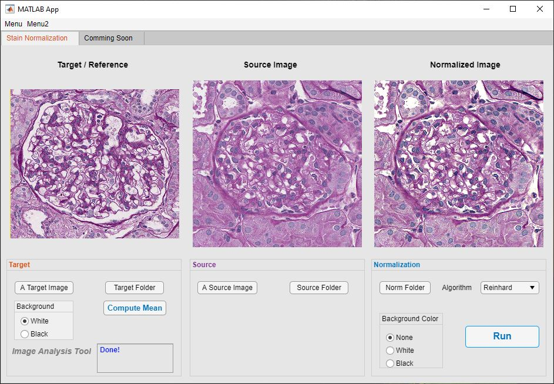

## Stain Normalization

### publication: Unsupervised machine learning for identifying important visual features through Bag-of-Words using histopathology data from Chronic Kidney Disease

Stain normalization is an important pre-processing task in modern digital pathology. This task reduces the color and intensity variations present in stained images from different laboratories.

**Figure 1**. Stain normalization tool
